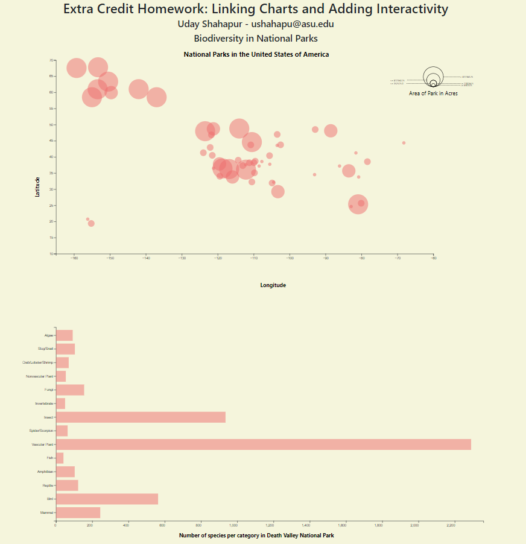
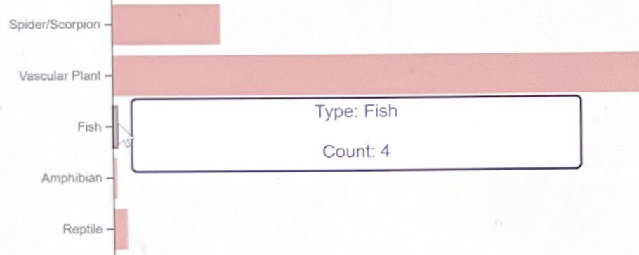
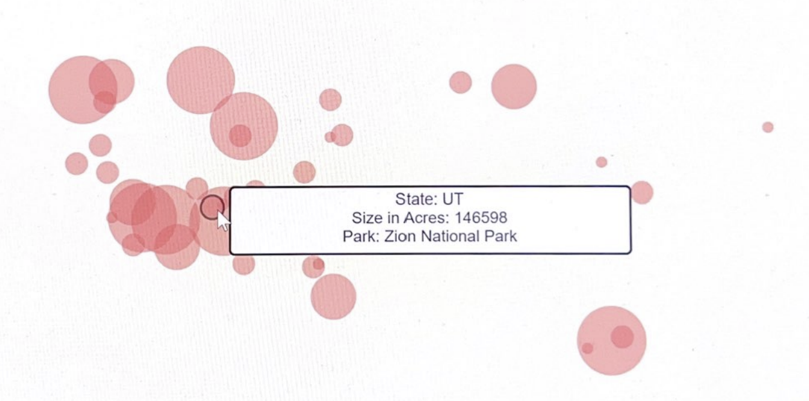

# Extra Credit Homework: Linking Charts and Adding Interactivity

The purpose of this homework is to give you practice interactively building and linking two visualizations together in D3. By the end of this assignment you should be able to:

- Preprocess Data in a language of your choice (preferably Python)
- Visualize multiple attributes of dataset in a bubble plot
- Dynamically update charts based on user interactions
- Add an interactive tooltip for any graph

The screenshot below shows an example of what your finished interface will look like.

## Overview

The starter code for this assignment consists of two divs on the `index.html` page. Each div should be appended with an svg for a different plot. The first plot is a bubble chart that depicts National Parks in the United States by latitude and longitude. You 
are also expected to make a channel based on area and have an appropriate legend for the plot.
The user can select any park in this graph and there should be some feedback that a park is being considered for selection on hover.

Clicking a bubble will create a bar graph in the bottom div. In the bar graph, you are supposed to display the count of unique species of wildlife/vegetation categories in the species.csv for that particular bubble.

Since the graphs will be difficult to read exact values of Park area and count of species, you are also expected to show important details regarding both of them to help with graph readability.

## Data Description

The `parks.csv` file consists of a list of National Parks in the USA and the `species.csv` consists of a list of species in each park. Processing these two csvs will give you the required data to plot the required graphs. An important part of Data Visualisation is Data Processing. You are not always provided with the required data in a suitable manner. Sometimes, you will need to alter or combine multiple datasets to get the required data to plot the graphs.  

## To complete the assignment

- Clone this code template to your local machine.
- Start a local server and open the `index.html` page.
- Modify the given code according to the instructions below to achieve the requested interface.
- Commit and push the code back to this repository to submit it.

## Step 0: Starting code

When you first run the page, you should see the empty interface. Add your name and email to the top. A separate JS file is provided to you and if you want to, you can write the javascript code in the `index.html` file itself. However, this is not a good industry practice so I would suggest to use the `/js/main.js` file to hold your javascript code.

## Step 1: Processing the data

A very important task to complete before starting any visualisation is to analyze the data and make sure you have enough information to plot your graphs. Sometimes, you will need to merge data from different csv files or process data within the same csv file to get additional derived information.
You are provided a `/dataManipulation` folder. You can write some code here to give you the required information or create new csvs for both graphs.

| 🔍 **Hint:** Make sure your dataset is in the correct form when interacting with the bubble plot. Note that you require the count of unique categories of species (example: Mammal, Bird etc).

## Step 2: Displaying a bubble plot 

- When the page loads, the bubble plot should be displayed. The X and Y axes should represent the Longitude and Latitude respectively.
You must also figure out a way to display (choose appropriate radiuses) the sizes of the bubbles in a way to represent the area of the National Park.
- Your bubbleplot should be inside the `#visOne` div. You may choose the margin around the chart, but make sure it doesn't go outside of the `div`'s bounds, and that it's not too small.
- Give the bubbles in this chart a 1 pixel black border on hover so that the user can know which bubble he/she is interacting with as there will be overlap. On selecting a bubble which depicts a National Park, a bar graph needs to be plotted.

| 🔍 **Hint:** Make sure your dataset is in the correct form when creating the bubble plot. You may want to modify the order of the rows so that each and every bubble can be selected. (Sometimes, a small bubble can be overlapped with a bigger bubble. You will not receive a full score if this is the case)

## Step 3: Displaying the bar chart

When the user clicks on a bubble in the bubbleplot, draw a bar graph diagram in the bottom div. The chart should be centered in the panel (with reasonable margins, similar to the screenshots), with nodes sized based on the counts of each category.

- Have an appropriate amount of spacing/padding between the rectangles. It's upto you to decide whether a vertical or horizontal bar plot is required here.
- If the user clicks on a different bubbles in the bubble plot, re-load the bar diagram for the selected National Park. 
- You should also update the text at the top or bottom of this panel whenever a Sasnkey chart is loaded. When no chart is shown, do not display the bar plot at all. When a bubble is selected, it should say `Number of species per category in 'National Park'`, where `National Park` is the selected bubble.

## Step 4: Add a hover tooltip to the two charts

Finally, add a tooltip to the two charts. When the user hovers over a bubble in the bubble plot, display the name of the hovered National Park, which state it is in and the area of that National Park. When a user hovers over a rectangle in the bar diagram, show the count for that particular category.

The tooltip can be styled according to you and it should smoothly follow the user's mouse as it moves along the rectangle, and disappear when it's no longer over the bubble/rectangle. You'll want to use mouse events to control this functionality (`mouseover`, `mousemove`, `mouseout`). 

| 🔍 **Hint:** There are multiple ways to implement tooltips. One option is defining a div that's hidden unless you are hovering over a bar; when that happens, you populate the div with the necessary info, change its display to visible, and move it to the appropriate position on the so it follows the mouse's x/y position on the page. See  this page which for an example: [https://bl.ocks.org/d3noob/97e51c5be17291f79a27705cef827da2](https://bl.ocks.org/d3noob/97e51c5be17291f79a27705cef827da2).

| 🔍 **Hint:** When you mouse over a bubble, you want to select the currently hovered data point. Inside your `mouseover`/`mousemove`/`mouseout` functions, you can have two parameters like so: `.on('mouseover', function(d, i) { ...})`. Use the Dev Tools to see what the `d` and `i` objects are, and what properties they contain, as a way to figure out how to reference the data item that is currently part of the event (i.e., that corresponds to the rectangle).

## Extra Credit

You can receive up to two extra credit points for this assignment. Each bullet point is worth up to two points (depending on quality  of implementation).

- Implement any additional form of data visualisation that shows an even more detailed information of the particular category selected in the bar graph. You are free to be open minded about this. You can display a word cloud, a table, a pie/donut plot etc.
The main motivation for this is for you to understand interaction and passing data between plots that will help you in further programming assignments and your group project implementation. 

## Grading

This assignment is worth 10 points.

- Step 0 is worth 1 point. 
- Step 1 is worth 2 points. 
- Step 2 is worth 4 points. You will not get a full score here if any bubble is not able to be selected. 
- Step 3 is worth 2 points.
- Step 4 is worth 1 point.
- The Extra Credit is worth up to 2 bonus points.